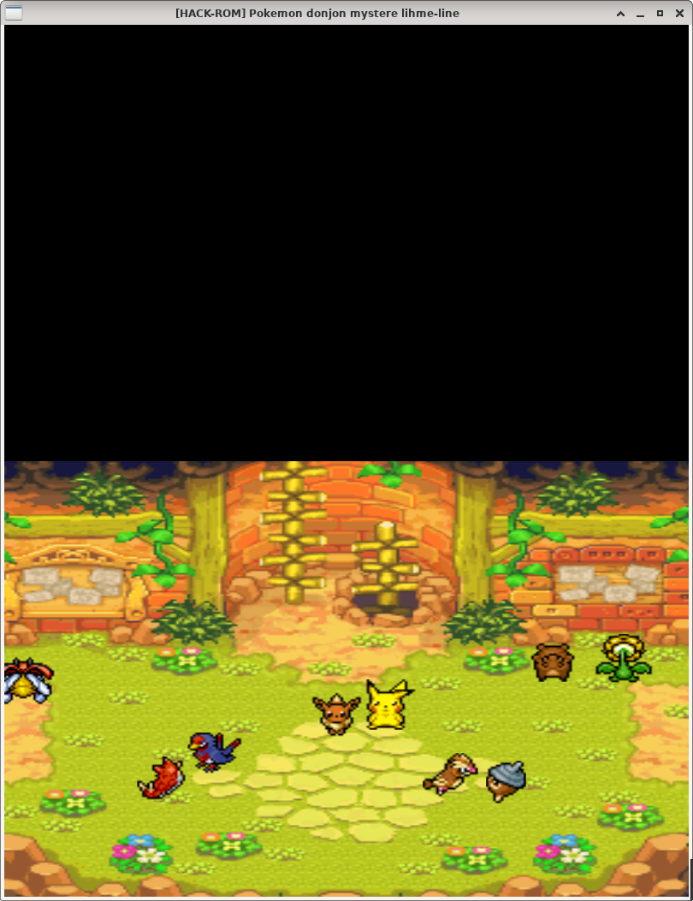

# my_rpg

Réalisation d'un RPG en groupe de 5 à l'aide de la CSFML

Pour le projet final de l'année nous avons choisis de recréer le fameux jeu 'Pokémon Donjon Mystère: Explorateur du ciel'.  
Nous avons d'abord commencé par améliorer le game_engine que nous avions créer au cours du projet my_defender afin de rajouter un systems de prefabs,  
ainsi que la gestion de certaines fonctionnalités de la CSFML que nous n'avions pas implémentées auparavant.  

Grace au game engine nous avons pu réaliser un jeu en trois parties, composé de cinématiques, d'une phase dans le village/guilde ou le joueur peut  
interagir avec les différents pokémons, ainsi qu'une phase dans les donjons ou le joueur doit se battre en explorant.  

Menu principal:

Images extraites de cinématiques:

Image extraite de la guilde:

Images extraites des donjons:

